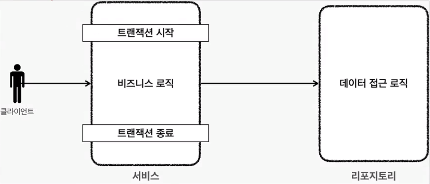
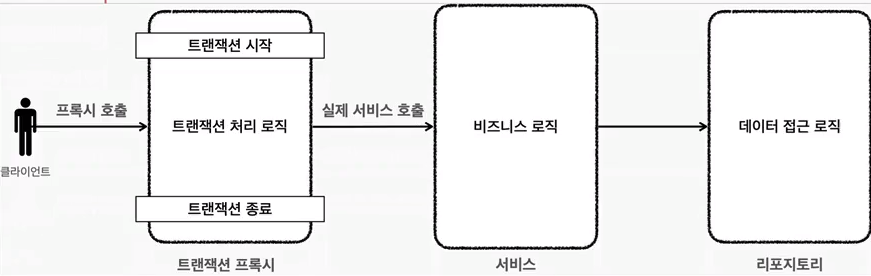
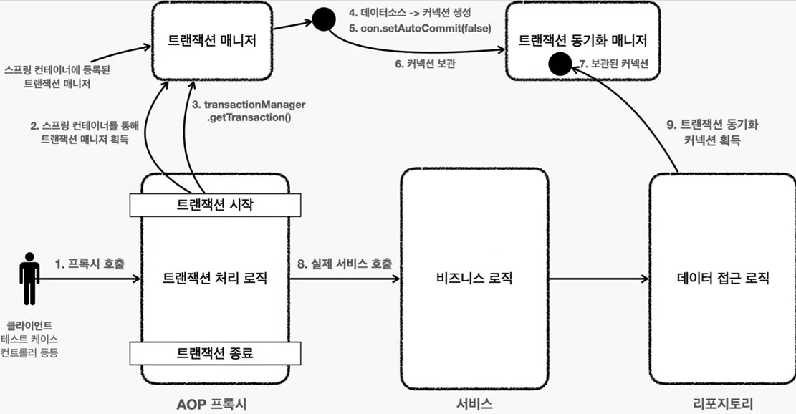

## 트랜잭션 AOP 이해

스프링은 트랜잭션 처리를 하는 코드와 실제로 수행하는 비지니스 로직을 AOP(프록시 패턴) 를 통해 명확하게
분리시켜 놓았다.

AOP 를 적용하기 전에는 아래와 같이 서비스 로직에 트랜잭션을 시작하고 끝내는 로직이 같이 들어가있었지만

AOP (프록시 패턴) 을 적용하고 나면 아래사진과 같이
프록시에서 트랜잭션을 시작하고 프록시가 대신 실제 비지니스 로직을 대신 실행시키고 문제가 없으면 커밋하는
흐름으로 동작하여 역할을 분리시킬 수 있다.

> * 프록시 패턴은 프록시를 통해 실제적인 target class 를 대신 수행해주는 일종의 디자인 패턴이다.

### 스프링이 제공하는 트랜잭션 AOP

모두가 알고있겠지만 스프링에서 제공하는 트랜잭션 AOP 는 `org.springframework.transaction.annotation.Transactional` 어노테이션이다.

### 참고

- 스프링 AOP 를 적용하려면 Advisor, Pointcut, Advice 가 필요하다. 스프링은 트랜잭션 AOP 를 처리하기위해
아래와 같은 클래스를 제공한다. 또한, 스프링 부트를 사용하면 해당 Bean 들은 스프링 컨테이너에 자동등록된다.

Advisor : `BeanFactoryTransactionAttributeSourceAdvisor`

Pointcut : `TransactionAttributeSourcePointcut`

Advice : `TransactionInterceptor`

## 트랜잭션 AOP 정리

트랜잭션 AOP 가 적용된 전체 흐름을 그림으로 정리해보자.

1. 프록시객체 호출 (@Transactional 이 포함된 클래스에 대한 프록시 객체)
2. Spring Container 로부터 TransactionManager 를 획득

3. 트랜잭션을 시작 (transactionManager.getTransaction()).
4. 데이터소스로부터 커넥션을 생성.
5. 실제 DB 에 setAutoCommit(false) 로 수동커밋모드를 만들어 트랜잭션을 시작.
6. 트랜잭션 동기화를 위해 커넥션을 보관.
7. 커넥션은 트랜잭션 동기화 매니저에 보관됨.

8. 프록시객체가 대신 Target Class (Service) 를 호출
9. 트랜잭션 동기화 매니저로부터 커넥션을 획득해서 레포지토리계층의 쿼리를 직접 실행

### 선언적 트랜잭션 관리 vs 프로그래밍 방식 트랜잭션 관리

#### 선언적 트랜잭션 관리 (Declarative Transaction Management)

- `@Transactional` 어노테이션 하나만 선언해도 매우 편리하게 트랜잭션을 적용하는 것을 선언적 트랜잭션 관리라고 말함
- 선언적 트랜잭션 관리는 과거 XML 에 설정하기도했다. 이름 그대로 해당 로직에 트랜잭션을 적용하겠다라고 어딘가에 선언하기만하면 트랜잭션이 적용되는 방식이다.

#### 프로그래밍 방식의 트랜잭션 관리 (Programmatic Transaction Management)

- TransactionManager 또는 TransactionTemplate  등을 사용해서 트랜잭션 관련 코드를 직접 작성하는 것을 프로그래밍 방식의 트랜잭션 관리라고 말함

#### 결론

- 선언적 트랜잭션 관리가 프로그래밍 방식에 비해 훨씬 실용적이기 때문에 실무에서는 대부분 해당 방식을 사용
- 프로그래밍 방식의 트랜잭션 관리는 스프링 컨테이너나 스프링 AOP 기술 없이 간단히 사용할 수 있지만 실무에서는 대부분 스프링 컨테이너와 스프링 AOP 를 사용하기 떄문에 거의 사용되지 않음.
- 프로그래밍 방식 트랜잭션 관리는 테스트 시에 가끔 사용될 떄는 있다.

#### 정리

- 스프링이 제공하는 선언적 트랜잭션 관리 덕분에 트랜잭션 관련 코드를 순수한 비지니스 로직에서 제거할 수 있다.
- 개발자는 트랜잭션이 필요한 곳에 @Transactional 어노테이션 하나만 추가하면 된다. 나머지는 스프링 트랜잭션 AOP 가 자동으로 처리해준다.

