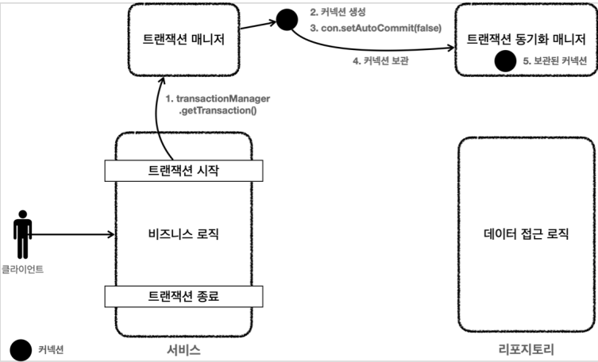
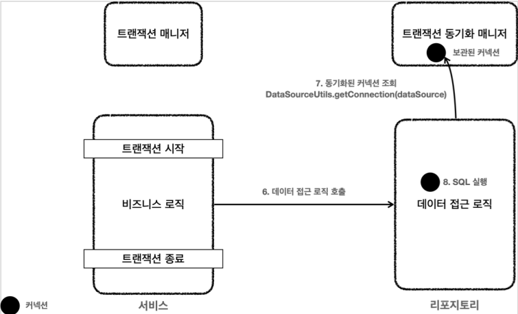

## 트랜잭션 추상화

만약 데이터 접근 기술이 달라지게되면, 특정 데이터 접근 기술에 의존하던 코드를 모두 변경해야한다.
하지만 Spring 은 이미 해당 문제에 대해 고민을 다 해두었고, 해당 문제를해결할 수 있는 해결책을 제시해놓았다.

### PlatformTransactionManager

스프링은 데이터 접근 기술마다 다른 트랜잭션의 사용법들을
추상화시켜놓았다. `TransactionManager` 를 확장한 `PlatformTransactionManager` 가 그 추상화된 트랜잭션관리 기술을 제공하는 인터페이스이다.
아래 사진과같이 기존의 Repository 계층에서 PlatformTransactionManager 인터페이스에 의존하면
데이터 접근 기술이 바뀌어도 트랜잭션을 해결하는 문제를 OCP 를 지키면서 확장 할 수 있다.

> - 참고로 스프링 5.3 부터는 JDBC 트랜잭션을 관리할 때 DataSourceTransactionManager 를 상속받아서
약간의 기능을 확장한 JdbcTransactionManager 를 제공한다. 둘의 기능 차이는 크지 않으므로 같은 것으로 이해하면 된다.

## 트랜잭션 동기화

스프링이 제공하는 트랜잭션 매니저는 크게 2가지 역할을 한다.

1. 트랜잭션 추상화
2. 리소스 동기화

트랜잭션을 유지하려면 트랜잭션의 시작부터 끝까지 같은 데이터베이스의 커넥션을 유지해야 한다.
결국 같은 커넥션을 동기화하기 위해서는 이전과같이 파라미터로 커넥션을 전달하는 방법을 사용했다.
파라미터를 커넥션을 전달하는 방법은 코드가 지저분해지는것은 물론이고, 커넥션을 넘기는 메서드와 넘기지 않는 메서드를 중복해서 만들어야 하는 등 여러가지 단점들이 많다.

### 커넥션과 세션

- 커넥션을 맺으면 DB 세션을 생성한다. 즉. 동일한 커넥션이면 동일한 세션이 사용된다.

### 트랜잭션 매니저와 트랜잭션 동기화 매니저

- 스프링은 `트랜잭션 동기화 매니저` 를 제공한다. 이것은 ThreadLocal 을 사용해서 커넥션을 동기화해준다. `트랜잭션 매니저`는 내부에서 이 `트랜잭션 동기화 매니저`를 사용한다.
- 트랜잭션 동기화 매니저는 ThreadLocal 을 사용하기 떄문에 멀티스레드 상황에 안전하게 커넥션을 동기화할 수 있다. 따라서 커넥션이 필요하면 트랜잭션 동기화 매니저를 통해 커넥션을 획득하면 된다.
따라서 이전처럼 파라미터로 커넥션을 전달하지 않아도 된다.

> - 트랜잭션 동기화 매니저 클래스는 TransactionSynchronizationManager 이며 내부적으로 ThreadLocal 을 사용한다.

#### 동작 방식을 간단하게 설명하면 다음과 같다.

1. Transaction 을 시작하려면 커넥션이 필요하다. TransactionManager 는 DataSource 를 통해 커넥션을 만들고 Transaction 을 시작한다.
2. TransactionManager 는 Transaction 이 시작된 커넥션을 `트랜잭션 동기화 매니저에 보관`한다.
3. Repository 는 트랜잭션 동기화 매니저에 보관된 커넥션을 꺼내서 사용한다. 따라서 파라미터로 커넥션을 전달하지 않아도 된다.
4. Transaction 이 종료되면 TransactionManager 는 트랜잭션 동기화 매니저에 보관된 커넥션을 통해 Transcation 을 종료하고, Connection 도 닫는다.

## DataSourceUtils 를 통한 트랜잭션 관리

`DataSourceUtils.getConnection()`

- TransactionSynchronizationManager 가 관리하는 커넥션이 있으면 해당 Connection 을 반환한다.
- TransactionSynchronizationManager 가 관리하는 커넥션이 없을 경우 새로운 Connection 을 생성해서 반환한다.

`DataSourceUtils.releaseConnection()`

- connection.close() 를 통해 Connection 을 직접 닫아버리면 커넥션이 유지되지 않는 문제가 발생한다.
이 커넥션은 이후 로직은 물론이고, 트랜잭션을 종료 (커밋 혹은 롤백) 할때까지 살아있어야 한다.
- DataSourceUtils.releaseConnection() 은 Connection 을 바로 닫는 것이 아니라
트랜잭션을 사용하기 위해 동기화된 커넥션은 커넥션을 닫지 않고 그대로 유지해준다.
또한, TransactionSynchronizationManager 가 관리하는 Connection 이 없는 경우 해당 커넥션을 닫는다.

## 트랜잭션 문제 해결 - 트랜잭션 매니저

#### 트랜잭션 매니저 - 트랜잭션 시작

1. Service 계층에서 `transactionManager.getTransaction()` 을 호출해서 Transaction 을 시작한다.
2. Transaction 을 시작하려면 먼저 DB 커넥션이 필요하기 때문에 TransactionManager 는 내부에서 DataSource 를 사용해서 Connection 을 생성한다.
3. Connection 을 수동 커밋 모드로 변경해서 실제 데이터베이스의 트랜잭션을 시작한다.
4. Connection 을 TransactionSynchronizationManager 에 보관한다.
5. TransactionSynchronizationManager 는 ThreadLocal 에 Connection 을 보관한다. 따라서 멀티스레드 환경에 안전하게 커넥션을 보관할 수 있다.

#### 트랜잭션 매니저 - 로직 실행

6. Service 는 비지니스 로직을 실행하면서 Repository 의 메서드들을 호출한다. 이때 Connection 을 파라미터로 전달하지 않는다.
7. Repository 메서드들은 Transaction 이 시작된 Connection 이 필요하다. Repository 는 `DataSourceUtils.getConnection()` 을 사용해서
TransactionSynchronizationManager 에 보관된 Connection 을 꺼내서 사용한다. 이 과정을 통해서 자연스럽게 같은 커넥션을 사용하고, 트랜잭션도 유지된다.
8. 획득한 Connection 을 사용해서 SQL 을 데이터에비으세 전달해서 실행한다.

#### 트랜잭션 매니저 - 트랜잭션 종료

9. 비지니스 로직이 끝나고 트랜잭션을 종료한다. 트랜잭션은 커밋하거나 롤백하면 종료된다.
10. 트랜잭션을 종료하려면 동기화된 Connection 이 필요하다. TransactionSynchronizationManager 를 통해 동기화된 커넥션을 획득한다.
11. 획득한 Connection 을 통해 DB 에 트랜잭션을 커밋하거나 롤백한다.
12. 전체 리소스를 정리한다.
    - `DataSourceUtils.releaseConnection()` 을 사용해서 TransactionSynchronizationManager 를 정리한다. ThreadLocal 은 사용후 꼭 정리해야 한다.
    - connection.setAutoCommit(true) 로 되돌린다. Connection Pool 을 고려해야 한다.
    - connection.close() 를 호출해서 Connection 을 종료한다. Connection Pool 을 사용하는 경우 connection.close() 를 호출하면 커넥션 풀에 반환된다.
    
#### 트랜잭션 매니저 - 정리

- 트랜잭션 추상화 덕분에 Service 코드는 JDBC 기술에 의존하지 않아도 된다.
  - 이후 JDBC 에서 JPA 로 변경해도 Service 코드를 그대로 유지할 수 있다.
  - 기술 변경 시 의존관계 주입만 `DataSourceTransactionManager` 에서 `JpaTransactionManger` 로 변경해주면 된다.
- 트랜잭션 동기화 매니저 (TransactionSynchronizationManager) 덕분에 Connection 을 파라미터로 넘기지 않아도 된다.
