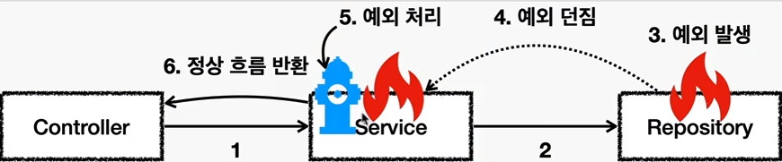
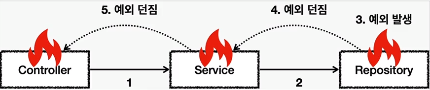

## 자바의 예외 계층

1. Object
   - 예외도 객체. 모든 객체의 최상위 부모는 `Object` 이므로 예외의 최상위 부모도 `Object` 이다.
2. Throwable
    - 최상위 예외이며. 하위에 `Exception` 과 `Error` 가 있다.
3. Error
    - 메모리 부족이나 심각한 시스템 오류와 같이 애플리케이션에서 복구 불가능한 시스템 예외이다. 애플리케이션 개발자는 이 예외를 잡으려고 해서는 안된다.
        - 상위 예외를 `catch` 로 잡으면 그 하위까지 함께 잡는다. 따라서 애플리케이션 로직에서는 `Throwable` 예외도 잡으면
        안되는데, 앞서 이야기한 `Error` 예외도 함께 잡을 수 있기 때문이다. 애플리케이션 로직은 이런 이유로 `Exception` 부터 필요한 예외로 생각하고 잡으면 된다.
        - 참고로 `Error` 도 언체크 예외이다.
4. Exception : 체크 예외
    - 애플리케이션 로직에서 사용할 수 있는 실질적인 최상위 예외이다.
    - `Exception` 과 그 하위 예외는 모두 컴파일러가 체크하는 체크 예외이다. 단 `RuntimeException` 은 예외로 한다.
5. RuntimeException : 언체크 예외, 런타임 예외
    - 컴파일러가 체크하지 않는 언체크 예외이다.
    - RuntimeException 과 그 자식 예외는 모두 언체크 예외이다
    - RuntimeException 의 이름을 따라서 RuntimeException 과 그 하위 언체크 예외를 `런타임 예외` 라고 많이 부른다.

### 예외 기본 규칙

예외는 폭탄 돌리기와 같다. 잡아서 처리하거나, 처리할 수 없으면 밖으로 던져야 한다.

아래 사진의 `5번` 에서 예외를 처리하면 이후에는 애플리케이션 로직이 정상 흐름으로 동작한다.

하지만 아래 사진처럼 예외를 처리하지 못하면 호출한 곳으로 예외를 계속 던지게 된다.

예외에 대해서는 기본적으로 2가지만 기억하자.
1. 예외는 잡아서 처리하거나 던져야 한다.
2. 예외를 잡거나 던질 때 지정할 예외뿐만 아니라, 그 예외의 자식들도 함께 처리된다.
   - 예를 들어서 Exception 을 catch 로 잡으면 그 하위 예외들도 모두 잡을 수 있다.
   - 예를 들어서 Exception 을 throws 로 던지면 그 하위 예외들도 모두 던질 수 있다.

#### 참고

**예외를 처리하지 못하고 계속 던지면 어떻게 될까?**

- 자바 main() 스레드의 경우 예외 로그를 출력하면서 시스템이 종료된다.
- 웹 애플리케이션일 경우 여러 사용자의 요청을 처리하기 때문에 하나의 예외 때문에 시스템이 종료되면 안된다.
따라서 WAS 가 해당 예외를 받아서 처리하는데, 주로 사용자에게 개발자가 지정한 오류, 페이지를 보여준다.

### 체크 예외

- 기본적으로 컴파일러가 체크하는 예외이며 `Exception` 을 상속하게되면 체크예외가 된다.
(단 RuntimeException 은 제외)
- 체크 예외는 메서드 안에서 catch 로 처리하거나 체크 예외를 다시 밖으로 throws 를 해야한다.
- 체크 예외를 처리할 수 없을 때에는 `method() throws 예외` 를 사용해서 밖으로 던질 예외를 필수로 지정해야한다.
체크 예외를 밖으로 던지지 않으면 컴파일 오류가 발생한다.
- 체크 예외를 메서드안에서 catch 로 잡게되면 정상로직 흐름으로 동작한다.

#### 장점

- 개발자가 실수로 예외를 누락하지 않도록 컴파일러를 통해 문제를 잡아주는 훌륭한 안전장치 이다.
왜냐하면 발생한 체크예외를 밖으로 throws 를 하지 않고 프로그램을 실행하면 컴파일이 되지 않기 때문이다.

#### 단점

- 개발자가 모든 체크 예외를 반드시 잡거나 던지도록 처리해야 하기 때문에, 너무 번거롭다.
- 추가적으로 의존관계에 따른 단점도 있다.

### 언체크 예외

- RuntimeException 과 그 하위 예외는 언체크 예외로 분류된다.
- 언체크 예외는 말 그대로 컴파일러가 체크하지 않는다는 뜻이다.
- 언체크 예외는 체크 예외와 기본적으로 동일하다. 차이가 있다면 예외를 던지는 throws 를 선언하지 않고, 생략할 수 있다.
이 경우 자동으로 예외를 던진다.

#### 장점

- 신경쓰고 싶지 않은 언체크 예욀르 무시할 수 있다. 체크 예외의 경우 처리할 수 없는 예외를 항상 `throws 예외` 를 선언해야 하지만, 언체크 예외는 이 부분을 생략할 수 있다.
- 신경쓰고 싶지 않은 예외의 의존관계를 참조하지 않아도 되는 장점이 있다.

#### 단점

- 언체크 예외는 개발자가 실수로 예외를 누락할 수 있다. 반면에 체크 예외는 컴파일러를 통해 예외 누락을 잡아준다.

### 체크 예외 vs 언체크 예외

- 체크 예외 : 예외를 잡아서 처리하지 않으면 항상 `throws` 에 던지는 예외를 선언해야 한다.
- 언체크 예외 : 예외를 잡아서 처리하지 않아도 `throws` 를 생략할 수 있다.

> - 체크예외와 언체크 예외의 차이는 사실 예외를 처리할 수 없을 때 예외를 밖으로 던지는 부분에 있다. 이 부분을 필수로 선언해야 하는가 아니면 생략할 수 있는가의 차이이다.

## 체크, 언체크 예외 사용 컨벤션

- 기본적으로 언체크(RuntimeException) 을 사용하자.
- 체크 예외는 비즈니스 로직상 로직이 너무 중요해서 의도적으로 던지는 예외에만 사용하자.
  - 이 경우 해당 예외를 잡아서 반드시 처리해야 하는 문제일때만 체크 예외를 사용해야 한다.
    - 예를 들어 계좌 이체 실패 예외
    - 결제 시 포인트 부족 예외
    - 로그인 ID, PW 불일치 예외 

## 예외 포함과 StackTrace

예외를 전환할 때는 꼭 기존 예외를 포함해야한다. 그렇지 않으면 StackTrace 를 확인할 때 심각한 문제가 발생한다.
