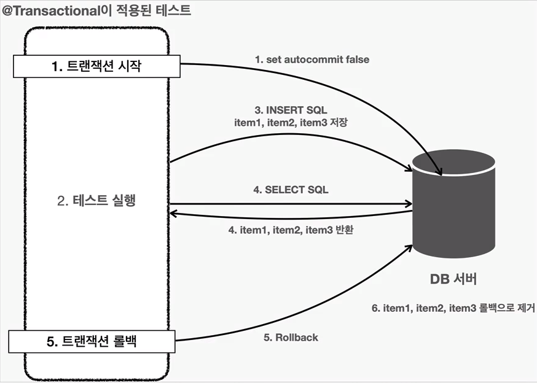

# 데이터 접근 기술 - 테스트

- test 폴더안에서 실행하게되면 test > resources 안에있는 `aplication.properties` 를 읽게된다.
test > resources 안에있는 properties 설정파일에도 DataSource 설정을 해야 정상적으로 데이터 접근 기술에 대한 테스트가 가능하다.

## @SpringBootTest

- 테스트 Class 위에 `@SpringBootTest` 를 명시하게 되면 상위패키지로 올라가면서
  `@SpringBootApplication` 가 달려있는 자바파일을 찾아 해당 파일을 설정파일로 실행하게 된다.

> - 테스트에서 중요한 것은 격리성 (Isolation) 이다. 따라서 DB 를 분리해야 한다.
분리하지 않으면 prod 환경에서 쌓인 데이터와 같이 병합되서 테스트가 되기떄문에 문제가 발생하게 된다.

## 테스트 데이터베이스 분리

prod db 와 test db 를 분리하는 가장 간단한 방법은 데이터베이스를 별도로 운영하는 것이다.
즉 두가지 환경의 properties 파일에 각기 다른 DataSource URL 을 넣어주는 것이다.

1. prod 환경 : `jdbc:h2:tcp://localhost/~/test`
2. test 환경 : `jdbc:h2:tcp://localhost/~/testcase`

하지만, 테스트 메서드에 사용된 쿼리가 결국엔 DB 에 저장되는것은 마찬가지이기 때문에
다른 테스트 메서드를 실행할때 영향을 주게 된다. 따라서 아래의 중요한 2가지 테스트 원칙을
위배하게 된다.

1. 테스트는 다른 테스트와 격리해야 한다.
2. 테스트는 반복해서 실행할 수 있어야 한다.

이를 해결하기 위해 모든 테스트 메서드 마지막에 호출되는 `@AfterEach` 로
`DELETE SQL` 을 실행하는 방법도 있긴하지만 이는 좋은 방법이 아니다.
왜냐하면 만약 테스트 시, 예상치 못한 이유로 애플리케이션이 종료되면 DELETE 가 실행되지 않을 수도 있다.

## 테스트 데이터 Rollback

앞서 바로 위에서 설명한 문제를 해결하는방법은 트랜잭션을 활용하는것이다.
바로 테스트가 끝나고 Rollback 시키는 것이다. 흐름을 요약해보면 아래와 같다.

테스트 A

1. 트랜잭션 시작
2. 테스트 A 실행
3. 트랜잭션 롤백

테스트 B

1. 트랜잭션 시작
2. 테스트 B 실행
3. 트랜잭션 롤백

따라서 다음 테스트에 영향을 주지 않게 된다.

### 방법

1. TransactionManager 를 주입받고
2. @BeforeEach 에서 트랜잭션을 시작하고
3. @AfterEach 에서 트랜잭션을 롤백해주면 된다.

```java
@SpringBootTest
class ItemRepositoryTest {

  @Autowired ItemRepository itemRepository;
  @Autowired PlatformTransactionManager transactionManager;
  TransactionStatus transactionStatus;

  @BeforeEach
  void beforeEach() {
    this.transactionStatus = transactionManager.getTransaction(new DefaultTransactionDefinition()); // 트랜잭션을 시작
  }

  @AfterEach
  void afterEach() {
    transactionManager.rollback(this.transactionStatus); // 트랜잭션 롤백
  }
  
  // 테스트코드 1..

  // 테스트코드 2..
}
```

## 테스트 데이터 Rollback - @Transactional

사실 이전 방식에서 `TransactionManager` 를 주입받아 직접 트랜잭션을 시작해주고
롤백해주는 방법은 좋긴하지만 번거롭다. 

하지만 스프링은 데이터 초기화를 위해 트랜잭션을 적용하고 롤백하는 방식을 `@Transcational` 어노테이션으로 하나로 깔끔하게
해결한다.

> - 서비스 코드에서 트랜잭션을 적용하기 위해 사용되는 @Transcational 과 같은 어노테이션이다.
하지만 이 어노테이션이 테스트코드에서 실행되면 조금 다르게 동작한다.

### @Transactional 원리

스프링이 제공하는 @Transactional 는 로직이 성공적으로 동작하면 커밋하도록 동작하고
Runtime 예외가 발생하면 롤백하게 동작한다.

하지만 @Transactional 이 테스트 코드에 있으면 테스트를 트랜잭션 안에서 실행하고
테스트가 끝나면 트랜잭션을 자동으롤 롤백시키도록 동작한다.



1. 테스트에 @Transactional 어노테이션이 테스트 메서드나 클래스에 있으면 먼저 트랜잭션을 시작한다.
2. 테스트 로직을 수행한다. 테스트가 끝날때까지 모든 로직은 트랜잭션 안에서 수행된다.
    - 트랜잭션은 기본적으로 전파되기 때무넹, 리포지토리에서 사용하는 JdbcTemplate 을 사용해서 데이터를 저장한다.
3. insert 를 통해 db 에 item 들을 저장한다.
    - 물론 테스트가 Repository 를 호출하고, Repository 는 jdbcTemplate 을 사용해서 데이터를 저장한다.
4. select 를 통해 db 에 저장된 item 들을 조회한다.
    - select 문도 같은 트랜잭션을 사용하기 때문에 저장한 데이터를 조회할 수 있다. 다른 트랜잭션에서는 해당 데이터를
    조회할 수 없다.
5. @Transactional 이 테스트에 있으면 테스트가 끝날 때 트랜잭션을 강제로 Rollback 한다.
6. Rollback 에 의해 앞서 db 에 저아한 item 들의 데이터가 제거된다.

> - 참고로 테스트 케이스의 메서드나 클래스에 @Transactional 을 직접 붙여서 사용할때만 이렇게 동작한다. (Rollback)
그리고 트랜잭션을 테스트에서 시작하기 때문에 Service, Repository 에 있는 @Transactional 도 테스트에서 시작한 트랜잭션에 참여한다.
(즉, 같은 트랜잭션)

### 강제로 커밋. @Commit, @Rollback(false)

테스트 케이스의 메서드나 클래스에 @Transactional 을 붙이면 자동으로 롤백된다.
하지만, Rollback 말고 진짜 db 에 저장하고 싶으면  @Commit 혹은 @Rollback(false) 를 달아주면 된다.

### 정리

- 테스트가 끝난 후 개발자가 데이터를 삭제하지 않아도 되는 편리함을 제공
- 테스트 실행 중에 데이터를 등록하고 중간에 테스트가 강제로 종료되어도 걱정이 없음
  (트랜잭션을 커밋하지 않기 때문에, 데이터는 자동으로 Rollback 된다. 보통 db 커넥션이 끊어지면 자동으로 Rollback 된다.)
- 트랜잭션 범위 안에서 테스트를 진행하기 때문에 동시에 다른 테스트가 진행되어도 서로 영향을 주지 않는 장점이 있다.
- 테스트 코드의 원칙을 지킬 수 있다.

## 테스트 - 임베디드 모드 DB

테스트 케이스를 실행하기 위해서 별도의 db 를 설치하고 운영하는것은 상단히 번잡하다.
단순히 테스트를 검증할 용도로만 사용하기 때문에 테스트가 끝나면 데이터베이스의 데이터를 모두 삭제해도 된다.
더 나아가 테스트가 끝나면 db 자체를 제거해도 된다.

### 임베디드 모드

H2 DB 는 자바로 개발되어 있고, JVM 안에서 메모리모드로 동작하는 특별한 기능을 제공한다. 그래서 애플리케이션을 실행할 때
H2 db 도 해당 JVM 메모리에 포함해서 함께 실행할 수 있다. db 를 애플리케이션에 내장해서 함꼐 실행된다고 해서
임베디드 모드라고 한다. 물론 애플리케이션이 종료되면 임베디드 모드로 동작하는 H2 db 도 함께 종료되고, 데이터도 모두 사라진다.
쉽게 얘기해서 애플리케이션에서 Java 메모리를 함께 사용하는 라이브러리 처럼 동작하는 것이다.

### 임베디드 모드 직접 사용

임베디드 모드 DB 를 사용하려면 아래와 같이 임베디드 db 의 DataSource Bean 을 
등록해주면 된다.

```java
@Bean
@Profile("test")
public DataSource dataSource() {
    log.info("Memory DB Init");
    DriverManagerDataSource dataSource = new DriverManagerDataSource();
    dataSource.setDriverClassName("org.h2.Driver");
    dataSource.setUrl("jdbc:h2:mem:db;DB_CLOSE_DELAY=-1");
    dataSource.setUsername("sa");
    dataSource.setPassword("");
    return dataSource;
}
```

properties 파일에 DataSource 관련 설정을 하게 되면 스프링부트는 DataSource Bean 과 
사용중인 데이터 접근 기술에 맞는 TransactionManger Bean 을 자동 등록한다.

하지만, 상단의 코드 블럭과 같이 DataSource 를 직접 Bean 으로 등록하게되면, 스프링부트의 자동구성 시점에
자동으로 등록되는 DataSource Bean 이 등록되지 않는다.
따라서 애플리케이션을 실행하게 되면 properties 에 설정한 DataSource 를 사용하지 않고, 방금 등록한 DataSource 를 사용하게된다.
그렇게 해서 임베디드 (인메모리) db 를 사용되게 되는 원리이다.

#### 임베디드 DB 에서 초기데이터는 어떻게?

메모리 DB 는 애플리케이션이 종료되면 함께 삭제되기 때문에 모든 정보가 사라진다. 따라서 애플리케이션 시작 시점에
인메모리 db 에 테이블도 따로 만들어주어야 한다.
스프링 부트는 Script SQL 를 통해 데이터 베이스 초기화 기능을 제공한다.

방법은 간단하다. resources 하위에 `schema.sql` 을 만들고 해당 파일 안에
ddl 을 작성해주면 된다. 파일이름에서 볼 수 있듯, 해당 파일로 DDL 을 정의하는것이다.

> - 디폴트 파일 이름은 schema.sql 이어야 한다. 물론 다른 파일 이름으로 동작하게 하는것도 설정을 통해 가능하다.
    spring.sql.init.schema-locations=classpath:원하는_이름.sql

또한, 스프링은 DML 초기화를 위한 기능도 제공한다. schema.sql 과 동일한 위치에 data.sql 이라는 파일을 만들어주고 DML 쿼리를 작성해주면
애플리케이션이 시작될 때, schema.sql 에서 DDL 을 호출하고 data.sql 에서 DML 이 실행되게 되어 초기데이터를 작성 가능하다.

> - DML DDL 따로 구분하지 않고, schema.sql 또는 data.sql 에서 모두 정의해도 된다.

### 디폴트는 임베디드 모드이다.

임베디드 모드 DB 는 굉장히 많이 사용된다. 따라서 스프링에서는 properties 에
DataSource 에 관한 설정(`DataSourceProperties`)이 없으면 임베디드 모드 DB 에 접근하는 `DataSource` 를 만들어서 사용한다.

