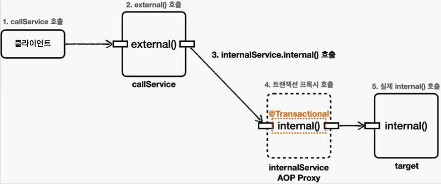

## 트랜잭션 적용 확인

`@Transactional` 을 통한 트랜잭션은 AOP 를 기반으로 동작하기 때문에, 실제 트랜잭션이 적용되고 있는지
아닌지를 확인하기가 어렵다.

```java
// 현재 Thread(ThreadLocal) 에 트랜잭션이 적용되어있는지 확인할 수 있는 기능. 트랜잭션의 적용 여부를 가장 확실하게 알 수 있다.
TransactionSynchronizationManager.isActualTransactionActive();
```

```properties
# 트랜잭션 프록시가 호출하는 트랜잭션의 시작과 종료를 명확하게 로그로 확인 가능
logging.level.org.springframework.transaction.interceptor=TRACE
```

## 트랜잭션 적용 위치

스프링에서 우선순위는 항상 `더 구체적이고 자세한 것이 높은 우선순위를 갖는다.`
따라서 Class 레벨에 `@Transactional(readOnly=true)` 를 달아도, 메서드에 레벨에
`@Transactional` 가 달려있으면 메서드 레벨의 트랜잭션이 사용되게 된다.

```java
// 트랜잭션이 Readonly 인지 확인
TransactionSynchronizationManager.isCurrentTransactionReadOnly();
```

### 인터페이스에 @Transactional 적용

인터페이스에도 @Transactional 을 적용할 수 있다. 이 경우 다음 순서로 적용된다. 구체적인 것이 더 높은 우선순위를 가진다고 생각하면
바로 이해가 될 것이다.

1. 클래스의 메서드 (우선순위가 가장 높다)
2. 클래스 타입
3. 인터페이스의 메서드
4. 인터페이스의 타입 (우선순위가 가장 낮다)

## 트랜잭션 AOP 주의사항 - 프록시 내부 호출

@Transactionl 을 사용하면 스프링의 트랜잭션 AOP 가 적용된다.
기본적으로 프록시 방식의 AOP 를 사용하기 때문에 프록시객체가 요청을 먼저 받아 트랜잭션을 처리하고
실제 객체를 호출해준다. 따라서 트랜잭션을 적용하려면 항상 프록시를 통해서 대상 객체를 호출하게 된다.
만약 프록시를 거치지 않고 대상 객체를 직접 호출하게 되면 AOP 가 적용되지 않고, 트랜잭션도 적용되지 않는다.

AOP 를 적용하면 스프링은 대상 객체 대신에 프록시를 스프링 Bean 으로 등록한다. 따라서 스프링은 의존관계 주입시에
항상 실제 객체 대신에 프록시 객체를 주입한다. 프록시 객체가 주입되기 떄문에 대상 객체를 직접 호출하는 문제는 일반적으로 발생하지 않는다.
하지만, `대상 객체의 내부에서 메서드 호출이 발생하면 프록시를 거치지 않고 대상 객체를 직접 호출하는 문제가 발생`한다. 이렇게 되면
`@Transactional`이 있어도 트랜잭션이 적용되지 않는다. 실무에서 반드시 한번은 만나서 고생하는 문제이기 때문에 꼭 이해하고 넘어가자.

> 기본적으로 메서드 앞에는 this 가 붙기때문에, 메서드 내부에서 호출된 다른 메서드는
프록시 객체에서 호출되는 것이 아닌, 실제 객체에서 호출이 되게된다. 따라서 트랜잭션이 먹히지 않는것이다.

### 해결방법

1. 첫번째 가장 단순한 해결방법은 메서드 안에서 호출되는 `다른 메서드` 를 별도의 클래스로 분리하는 것이다.
   (이 방법을 실무에서 많이 사용한다.)



> 참고로 스프링 트랜잭션 AOP 는 `public` 메서드에만 트랜잭션을 적용하도록 기본 설정이 되어있다.
따라서 protected, private, package-visible 범위에는 트랜잭션이 적용되지 않는다. (예외는 아니고 무시된다.)
프록시의 내부호출문제와는 무관하며, 그냥 스프링이 막아둔 것이다.
