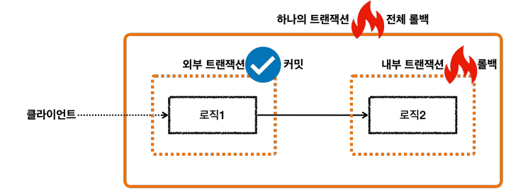
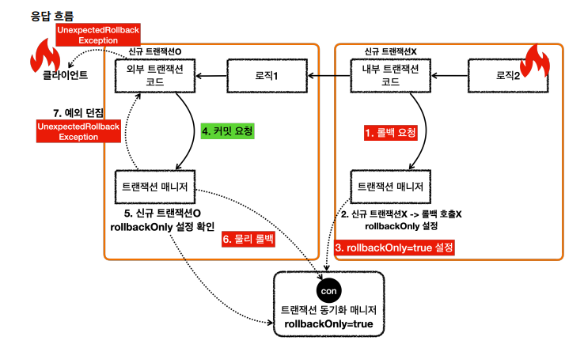
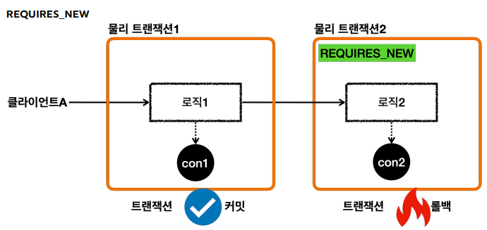
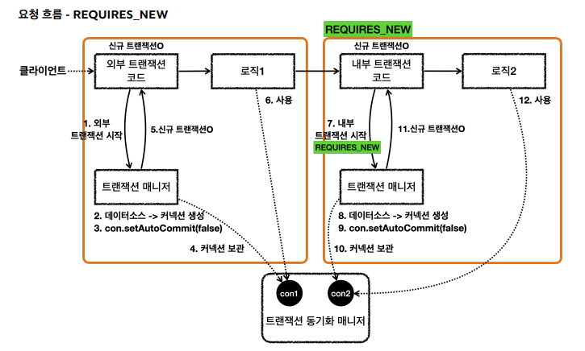
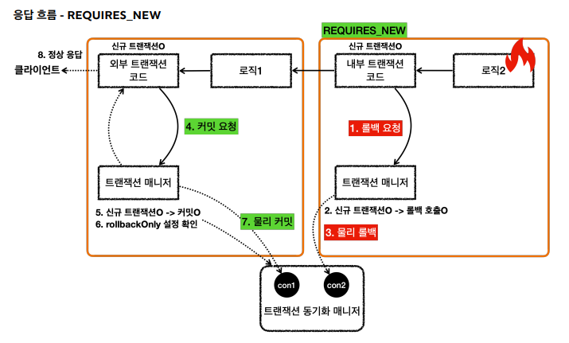

## 스프링 트랜잭션 전파 - 트랜잭션 한번 사용

### Commit 

```java
@Test
public void commit() {
    log.info("트랜잭션 시작");
    TransactionStatus status = platformTransactionManager.getTransaction(new DefaultTransactionAttribute());

    log.info("트랜잭션 커밋 시작");
    platformTransactionManager.commit(status);
    log.info("트랜잭션 커밋 완료");
}
```

```text
o.s.j.d.DataSourceTransactionManager     : Creating new transaction with name [null]: PROPAGATION_REQUIRED,ISOLATION_DEFAULT
o.s.j.d.DataSourceTransactionManager     : Acquired Connection [HikariProxyConnection@1203852392 wrapping conn0: url=jdbc:h2:mem:9532ff42-3551-4dfe-a4b7-50a15137f91e user=SA] for JDBC transaction
o.s.j.d.DataSourceTransactionManager     : Switching JDBC Connection [HikariProxyConnection@1203852392 wrapping conn0: url=jdbc:h2:mem:9532ff42-3551-4dfe-a4b7-50a15137f91e user=SA] to manual commit
c.e.s.propagation.BasicTxTest            : 트랜잭션 커밋 시작
o.s.j.d.DataSourceTransactionManager     : Initiating transaction commit
o.s.j.d.DataSourceTransactionManager     : Committing JDBC transaction on Connection [HikariProxyConnection@1203852392 wrapping conn0: url=jdbc:h2:mem:9532ff42-3551-4dfe-a4b7-50a15137f91e user=SA]
o.s.j.d.DataSourceTransactionManager     : Releasing JDBC Connection [HikariProxyConnection@1203852392 wrapping conn0: url=jdbc:h2:mem:9532ff42-3551-4dfe-a4b7-50a15137f91e user=SA] after transaction
c.e.s.propagation.BasicTxTest            : 트랜잭션 커밋 완료
```

### Rollback

```java
@Test
public void rollback() {
    log.info("트랜잭션 시작");
    TransactionStatus status = platformTransactionManager.getTransaction(new DefaultTransactionAttribute());

    log.info("트랜잭션 롤백 시작");
    platformTransactionManager.rollback(status);
    log.info("트랜잭션 롤백 완료");
}
```

```text
c.e.s.propagation.BasicTxTest            : 트랜잭션 시작
o.s.j.d.DataSourceTransactionManager     : Creating new transaction with name [null]: PROPAGATION_REQUIRED,ISOLATION_DEFAULT
o.s.j.d.DataSourceTransactionManager     : Acquired Connection [HikariProxyConnection@785140711 wrapping conn0: url=jdbc:h2:mem:0baf9460-f077-442e-af99-1afc8ab1f3eb user=SA] for JDBC transaction
o.s.j.d.DataSourceTransactionManager     : Switching JDBC Connection [HikariProxyConnection@785140711 wrapping conn0: url=jdbc:h2:mem:0baf9460-f077-442e-af99-1afc8ab1f3eb user=SA] to manual commit
c.e.s.propagation.BasicTxTest            : 트랜잭션 롤백 시작
o.s.j.d.DataSourceTransactionManager     : Initiating transaction rollback
o.s.j.d.DataSourceTransactionManager     : Rolling back JDBC transaction on Connection [HikariProxyConnection@785140711 wrapping conn0: url=jdbc:h2:mem:0baf9460-f077-442e-af99-1afc8ab1f3eb user=SA]
o.s.j.d.DataSourceTransactionManager     : Releasing JDBC Connection [HikariProxyConnection@785140711 wrapping conn0: url=jdbc:h2:mem:0baf9460-f077-442e-af99-1afc8ab1f3eb user=SA] after transaction
c.e.s.propagation.BasicTxTest            : 트랜잭션 롤백 완료
```

## 스프링 트랜잭션 전파 - 트랜잭션 두번 사용

### 트랜잭션이 각각 따로 사용되는 경우

커넥션은 재사용을 함. 트랜잭션이 끝나면 커넥션 풀에 커넥션을 반환하기 때문임.

하지만 이 둘은 완전히 다른 커넥션임. 커넥션풀에서 커넥션을 꺼낼때 내부적으로 히카리 프록시 커넥션이라는
객체를 생성해서 반환하기 떄문에, 이 주소가 다름 (히카리 프록시 커넥션 내부에는 실제 커넥션이 포함되어 있다.)

```java
@Test
public void double_commit() {
    log.info("트랜잭션1 시작");
    TransactionStatus status = platformTransactionManager.getTransaction(new DefaultTransactionAttribute());
    log.info("트랜잭션1 커밋");
    platformTransactionManager.commit(status);

    log.info("트랜잭션2 시작");
    TransactionStatus status2 = platformTransactionManager.getTransaction(new DefaultTransactionAttribute());
    log.info("트랜잭션2 커밋");
    platformTransactionManager.commit(status2);
}
```

```text
c.e.s.propagation.BasicTxTest            : 트랜잭션1 시작
o.s.j.d.DataSourceTransactionManager     : Creating new transaction with name [null]: PROPAGATION_REQUIRED,ISOLATION_DEFAULT
o.s.j.d.DataSourceTransactionManager     : Acquired Connection [HikariProxyConnection@237594516 wrapping conn0: url=jdbc:h2:mem:00b512b7-569c-4f38-8dcb-17d568b2d9c4 user=SA] for JDBC transaction
o.s.j.d.DataSourceTransactionManager     : Switching JDBC Connection [HikariProxyConnection@237594516 wrapping conn0: url=jdbc:h2:mem:00b512b7-569c-4f38-8dcb-17d568b2d9c4 user=SA] to manual commit
c.e.s.propagation.BasicTxTest            : 트랜잭션1 커밋
o.s.j.d.DataSourceTransactionManager     : Initiating transaction commit
o.s.j.d.DataSourceTransactionManager     : Committing JDBC transaction on Connection [HikariProxyConnection@237594516 wrapping conn0: url=jdbc:h2:mem:00b512b7-569c-4f38-8dcb-17d568b2d9c4 user=SA]
o.s.j.d.DataSourceTransactionManager     : Releasing JDBC Connection [HikariProxyConnection@237594516 wrapping conn0: url=jdbc:h2:mem:00b512b7-569c-4f38-8dcb-17d568b2d9c4 user=SA] after transaction
c.e.s.propagation.BasicTxTest            : 트랜잭션2 시작
o.s.j.d.DataSourceTransactionManager     : Creating new transaction with name [null]: PROPAGATION_REQUIRED,ISOLATION_DEFAULT
o.s.j.d.DataSourceTransactionManager     : Acquired Connection [HikariProxyConnection@210055609 wrapping conn0: url=jdbc:h2:mem:00b512b7-569c-4f38-8dcb-17d568b2d9c4 user=SA] for JDBC transaction
o.s.j.d.DataSourceTransactionManager     : Switching JDBC Connection [HikariProxyConnection@210055609 wrapping conn0: url=jdbc:h2:mem:00b512b7-569c-4f38-8dcb-17d568b2d9c4 user=SA] to manual commit
c.e.s.propagation.BasicTxTest            : 트랜잭션2 커밋
o.s.j.d.DataSourceTransactionManager     : Initiating transaction commit
o.s.j.d.DataSourceTransactionManager     : Committing JDBC transaction on Connection [HikariProxyConnection@210055609 wrapping conn0: url=jdbc:h2:mem:00b512b7-569c-4f38-8dcb-17d568b2d9c4 user=SA]
o.s.j.d.DataSourceTransactionManager     : Releasing JDBC Connection [HikariProxyConnection@210055609 wrapping conn0: url=jdbc:h2:mem:00b512b7-569c-4f38-8dcb-17d568b2d9c4 user=SA] after transaction
```

### 두개의 트랜잭션 - 커밋, 롤백

```java
@Test
public void double_commit_rollback() {
    log.info("트랜잭션1 시작");
    TransactionStatus status = platformTransactionManager.getTransaction(new DefaultTransactionAttribute());
    log.info("트랜잭션1 커밋");
    platformTransactionManager.commit(status);

    log.info("트랜잭션2 시작");
    TransactionStatus status2 = platformTransactionManager.getTransaction(new DefaultTransactionAttribute());
    log.info("트랜잭션2 롤백");
    platformTransactionManager.rollback(status2);
}
```

```text
c.e.s.propagation.BasicTxTest            : 트랜잭션1 시작
o.s.j.d.DataSourceTransactionManager     : Creating new transaction with name [null]: PROPAGATION_REQUIRED,ISOLATION_DEFAULT
o.s.j.d.DataSourceTransactionManager     : Acquired Connection [HikariProxyConnection@116806060 wrapping conn0: url=jdbc:h2:mem:68fe3ed2-48f1-4a44-989a-00c0ebdcb75d user=SA] for JDBC transaction
o.s.j.d.DataSourceTransactionManager     : Switching JDBC Connection [HikariProxyConnection@116806060 wrapping conn0: url=jdbc:h2:mem:68fe3ed2-48f1-4a44-989a-00c0ebdcb75d user=SA] to manual commit
c.e.s.propagation.BasicTxTest            : 트랜잭션1 커밋
o.s.j.d.DataSourceTransactionManager     : Initiating transaction commit
o.s.j.d.DataSourceTransactionManager     : Committing JDBC transaction on Connection [HikariProxyConnection@116806060 wrapping conn0: url=jdbc:h2:mem:68fe3ed2-48f1-4a44-989a-00c0ebdcb75d user=SA]
o.s.j.d.DataSourceTransactionManager     : Releasing JDBC Connection [HikariProxyConnection@116806060 wrapping conn0: url=jdbc:h2:mem:68fe3ed2-48f1-4a44-989a-00c0ebdcb75d user=SA] after transaction
c.e.s.propagation.BasicTxTest            : 트랜잭션2 시작
o.s.j.d.DataSourceTransactionManager     : Creating new transaction with name [null]: PROPAGATION_REQUIRED,ISOLATION_DEFAULT
o.s.j.d.DataSourceTransactionManager     : Acquired Connection [HikariProxyConnection@674349432 wrapping conn0: url=jdbc:h2:mem:68fe3ed2-48f1-4a44-989a-00c0ebdcb75d user=SA] for JDBC transaction
o.s.j.d.DataSourceTransactionManager     : Switching JDBC Connection [HikariProxyConnection@674349432 wrapping conn0: url=jdbc:h2:mem:68fe3ed2-48f1-4a44-989a-00c0ebdcb75d user=SA] to manual commit
c.e.s.propagation.BasicTxTest            : 트랜잭션2 롤백
o.s.j.d.DataSourceTransactionManager     : Initiating transaction rollback
o.s.j.d.DataSourceTransactionManager     : Rolling back JDBC transaction on Connection [HikariProxyConnection@674349432 wrapping conn0: url=jdbc:h2:mem:68fe3ed2-48f1-4a44-989a-00c0ebdcb75d user=SA]
o.s.j.d.DataSourceTransactionManager     : Releasing JDBC Connection [HikariProxyConnection@674349432 wrapping conn0: url=jdbc:h2:mem:68fe3ed2-48f1-4a44-989a-00c0ebdcb75d user=SA] after transaction
```

## 스프링 트랜잭션 전파 - 전파 기본

### 외부 트랜잭션이 수행중인데, 내부 트랜잭션이 추가로 수행되는 경우


스프링은 이 경우 외부 트랜잭션과 내부 트랜잭션을 묶어서 `하나의 트랜잭션을 만들어준다`.
내부 트랜잭션이 외부 트랜잭션에 참여하는 것이다. 이것이 기본동작이고, 옵션을 통해 다른 동작방식도 선택할 수 있다.


스프링은 이래를 돕기 위해 `논리 트랜잭션`과 `물리 트랜잭션`이라는 개념을 나눈다.
`논리 트랜잭션`들은 하나의 물리 트랜잭션으로 묶인다. `물리 트랜잭션` 은 우리가 이해하는 실제 DB 에 적용되는
트랜잭션을 뜻한다. 실제 Connection 을 통해서 트랜잭션을 시작(setAutoCommit(false)) 하고 실제 Connection 틍해 커밋, 롤백하는 단위이다.
또한, `논리 트랜잭션` 은 트랜잭션 매니저를 통해 트랜잭션을 사용하는 단위이다.
이러한 `논리 트랜잭션 개념은 트랜잭션이 진행되는 중에 추가로 트랜잭션을 사용하는 경우에 나타난다.`
**단순히 트랜잭션이 하나인 경우 둘을 구분하지는 않는다.** 더 정확히는
`REQUIRED` 전파 옵션을 사용하는 경우에 나타나고, 이 옵션은 뒤에서 설명한다.

#### 그렇다면 왜 트랜잭션을 논리, 물리로 나눴는가

트랜잭션이 사용중일때 또 다른 트랜잭션이 내부에 사용되면 여러가지 복잡한 상황이 발생한다. 이 때 논리 트랜잭션 개념을 도입하면
다음과 같은 단순한 원칙을 만들 수 있다.

1. 모든 논리 트랜잭션이 커밋되어야 물리 트랜잭션이 커밋된다.
2. 하나의 논리 트랜잭션이라도 롤백되면 물리트랜잭션은 롤백된다.

풀어서 설명하면 모든 트랜잭션 매니저를 커밋해야 물리 트랜잭션이 커밋된다. 하나의 트랜잭션 매니저라도 롤백하면
물리 트랜잭션은 롤백된다.


### 외부 트랜잭션이 수행중인데, 내부 트랜잭션이 추가로 수행되는 경우 (로그)

```text
c.e.s.propagation.BasicTxTest            : 외부 트랜잭션 시작
o.s.j.d.DataSourceTransactionManager     : Creating new transaction with name [null]: PROPAGATION_REQUIRED,ISOLATION_DEFAULT
o.s.j.d.DataSourceTransactionManager     : Acquired Connection [HikariProxyConnection@1494983472 wrapping conn0: url=jdbc:h2:mem:5379994c-9ecb-424c-a27d-5ac4b571018b user=SA] for JDBC transaction
o.s.j.d.DataSourceTransactionManager     : Switching JDBC Connection [HikariProxyConnection@1494983472 wrapping conn0: url=jdbc:h2:mem:5379994c-9ecb-424c-a27d-5ac4b571018b user=SA] to manual commit ---> (manual commit)은 DB 커넥션을 통한 물리 트랜잭션을 시작한다는 의미.
c.e.s.propagation.BasicTxTest            : outer.isNewTransaction() = true  ---> 새로운 트랜잭션임을 확인
c.e.s.propagation.BasicTxTest            : 내부 트랜잭션 시작
o.s.j.d.DataSourceTransactionManager     : Participating in existing transaction --> 기존의 트랜잭션에 참여
c.e.s.propagation.BasicTxTest            : inner.isNewTransaction() = false     --> 새로운 트랜잭션이 아님을 확인
c.e.s.propagation.BasicTxTest            : 내부 트랜잭션 커밋           --> 외부 커넥션이 커밋하지 않았으므로, 내부 트랜잭션이 커밋해도 어떠한 일이 일어나지 않음.
c.e.s.propagation.BasicTxTest            : 외부 트랜잭션 커밋           --> 외부 커넥션이 커밋했으므로, DB 에 커밋을 시작함. 
o.s.j.d.DataSourceTransactionManager     : Initiating transaction commit
o.s.j.d.DataSourceTransactionManager     : Committing JDBC transaction on Connection [HikariProxyConnection@1494983472 wrapping conn0: url=jdbc:h2:mem:5379994c-9ecb-424c-a27d-5ac4b571018b user=SA]
o.s.j.d.DataSourceTransactionManager     : Releasing JDBC Connection [HikariProxyConnection@1494983472 wrapping conn0: url=jdbc:h2:mem:5379994c-9ecb-424c-a27d-5ac4b571018b user=SA] after transaction
```

> 따라서 처음 트랜잭션을 시작한 외부 트랜잭션이 실제 물리 트랜잭션을 관리하도록 한다. 이를 통해 트랜잭션 중복 문제를 해결한다.

### 외부 트랜잭션이 수행중인데, 내부 트랜잭션이 추가로 수행되는 경우 (다이어그램)

**요청 흐름 - 외부 트랜잭션**

1. txManager.getTransaction() 을 호출해서 외부 트랜잭션을 시작.
2. 트랜잭션 매니저는 `DataSource` 를 통해 커넥션을 생성
3. 생성한 `Connection` 을 수동커밋모드로 설정하여 `물리 트랜잭션`을 시작
4. 트랜잭션 매니저는 트랜잭션 동기화 매니저에 Connection 을 보관
5. 트랜잭션 매니저는 트랜잭션을 생성한 결과를 `TransactionStatus` 에 담아서 보관하는데, 여기서 신규 트랜잭션의 여부가
담겨있다. isNewTransaction() 을 통해 신규 트랜잭션 여부를 확인할 수 있다. 트랜잭션을 처음 시작했으므로 신규 트랜잭션이다.
6. 로직1 이 사용되고,  커넥션이 필요한 경우 트랜잭션 동기화 매니저를 통해 트랜잭션이 적용된 Connection 을 획득해서 사용한다.

**요청 흐름 - 내부 트랜잭션**

7. txManager.getTransaction() 를 호출해서 내부 트랜잭션을 시작한다.
8. 트랜잭션 매니저는 트랜잭션 동기화 매니저를 통해서 기존 트랜잭션이 존재하는지 확인한다.
9. 기존 트랜잭션이 존재하므로 기존 트랜잭션에 참여한다. 기존 트랜잭션에 참여한다는 뜻은 사실, 아무것도 하지 않는다는 뜻이다.
    - 이미 기존 트랜잭션인 외부 트랜잭션에서 물리 트랜잭션을 시작했다. 그리고 물리 트랜잭션이 시작된 커넥션을 트랜잭션 동기화 매니저에 담아두었다.
    - 따라서 이미 물리 트랜잭션이 진행중이므로 그냥 두면 이후 로직이 기존에 시작된 트랜잭션을 자연스럽게 사용하게 되는 것이다.
    - 이후 로직은 자연스럽게 트랜잭션 동기화 매니저에 보관된 기존 커넥션을 사용하게 된다.
10. 트랜잭션 매니저는 트랜잭션을 생성한 결과를 `TransactionStatus` 에 담아서 반환하는데, 여기에서 isNewTransaction() 를 통해 신규 트랜잭션 여부를 
확인할 수 있다. 여기서는 기존 트랜잭션에 참여하였기 때문에 신규 트랜잭션이 아니다.
11. 로직2 가 사용되고, 커넥션이 필요한 경우 트랜잭션 동기화 매니저를 통해 외부 트랜잭션이 보관한 커넥션을 획득해서 사용한다.


**응답 흐름 - 내부 트랜잭션**

12. 로직2 가 끝나고 트랜잭션 매니저를 통해 내부 트랜잭션을 커밋한다.
13. 트랜잭션 매니저는 커밋 시점에 `신규 트랜잭션 여부에 따라 다르게 동작`한다. 이 경우 신규 트랜잭션이 아니기 때문에 실제 커밋을 호출하지 않는다.
이 부분이 중요한데, 실제 커넥션이나 롤백을 호출하면 물리 트랜잭션이 끝나버린다. 아직 트랜잭션이 끝난 것이 아니기 때문에 실제 커밋을 호출하면 안된다.
물리 트랜잭션은 외부 트랜잭션을 종료할때까지 이어져야 한다.

**응답 흐름 - 외부 트랜잭션**

14. 로직 1 이 끝나고 트랜잭션 매니저를 통해 외부 트랜잭션을 커밋한다.
15. 트랜잭션 매니저는 커밋 시점에 `신규 트랜잭션 여부에 따라 다르게 동작`한다. 외부 트랜잭션은 신규 트랜잭션이다. 따라서 DB 커넥션에 실제 커밋을 호출한다.
16. 트랜잭션 매니저에 커밋하는 것이 논리적인 커밋이라면, 실제 커넥션에 커밋하는것을 물리 커밋이라 할 수 있다. 실제 데이터베이스에 커밋이 반영되고, 물리 트랜잭션도 끝난다.


**핵심 정리**

- 여기서 핵심은 트랜잭션 매니저에 커밋을 호출한다고해서 `항상 실제 커넥션에 물리 커밋이 발생하지 않는다는 점`이다.
- `신규 트랜잭션인 경우에만` 실제 커넥션을 사용해서 물리 커밋과 롤백을 수행한다. 신규 트랜잭션이 아니면 실제 물리 커넥션을 사용하지 않는다.
- 이렇게 트랜잭션이 내부에서 추가로 사용되면 트랜잭션 매니저에 커밋하는 것이 항상 물리 커밋으로 이어지지 않는다. 그래서 이 경우 논리 트랜잭션과 물리 트랜잭션으로 나누게 된다.
또는 외부 트랜잭션과 내부 트랜잭션으로 나누어 설명하기도 한다.
- 트랜잭션이 내부에서 추가로 사용되면, 트랜잭션 매니저를 통해 논리 트랜잭션을 관리하고, 모든 논리 트랜잭션이 커밋되면 물리 트랜잭션이 커밋된다고 이해하면 된다.

### 내부 트랜잭션은 커밋되는데, 외부 트랜잭션이 롤백되는 상황 (외부 롤백)

```java
@Test
    @DisplayName("외부트랜잭션 롤백과 내부트랜잭션 커밋")
    public void outer_rollback() {
        log.info("외부 트랜잭션 시작");
        TransactionStatus outer = platformTransactionManager.getTransaction(new DefaultTransactionAttribute());
        log.info("outer.isNewTransaction() = {}", outer.isNewTransaction()); // 처음 수행된 트랜잭션이냐?

        log.info("내부 트랜잭션 시작");
        TransactionStatus inner = platformTransactionManager.getTransaction(new DefaultTransactionAttribute());
        log.info("inner.isNewTransaction() = {}", inner.isNewTransaction()); // 처음 수행된 트랜잭션이냐?
        log.info("내부 트랜잭션 커밋");
        platformTransactionManager.commit(inner);

        log.info("외부 트랜잭션 롤백");
        platformTransactionManager.rollback(outer);
    }
```

```text
c.e.s.propagation.BasicTxTest            : 외부 트랜잭션 시작
o.s.j.d.DataSourceTransactionManager     : Creating new transaction with name [null]: PROPAGATION_REQUIRED,ISOLATION_DEFAULT
o.s.j.d.DataSourceTransactionManager     : Acquired Connection [HikariProxyConnection@784121757 wrapping conn0: url=jdbc:h2:mem:f837beab-5235-4468-a5bf-1d1d83db509f user=SA] for JDBC transaction
o.s.j.d.DataSourceTransactionManager     : Switching JDBC Connection [HikariProxyConnection@784121757 wrapping conn0: url=jdbc:h2:mem:f837beab-5235-4468-a5bf-1d1d83db509f user=SA] to manual commit
c.e.s.propagation.BasicTxTest            : outer.isNewTransaction() = true
c.e.s.propagation.BasicTxTest            : 내부 트랜잭션 시작
o.s.j.d.DataSourceTransactionManager     : Participating in existing transaction
c.e.s.propagation.BasicTxTest            : inner.isNewTransaction() = false
c.e.s.propagation.BasicTxTest            : 내부 트랜잭션 커밋
c.e.s.propagation.BasicTxTest            : 외부 트랜잭션 롤백
o.s.j.d.DataSourceTransactionManager     : Initiating transaction rollback
o.s.j.d.DataSourceTransactionManager     : Rolling back JDBC transaction on Connection [HikariProxyConnection@784121757 wrapping conn0: url=jdbc:h2:mem:f837beab-5235-4468-a5bf-1d1d83db509f user=SA]
o.s.j.d.DataSourceTransactionManager     : Releasing JDBC Connection [HikariProxyConnection@784121757 wrapping conn0: url=jdbc:h2:mem:f837beab-5235-4468-a5bf-1d1d83db509f user=SA] after transaction
```

### 내부 트랜잭션은 롤백되는데, 외부 트랜잭션이 커밋되는 상황 (내부 롤백)



```java
@Test
@DisplayName("외부트랜잭션 커밋과 내부트랜잭션 롤백")
public void inner_rollback() {
     log.info("외부 트랜잭션 시작");
     TransactionStatus outer = platformTransactionManager.getTransaction(new DefaultTransactionAttribute());
     log.info("outer.isNewTransaction() = {}", outer.isNewTransaction()); // 처음 수행된 트랜잭션이냐?

     log.info("내부 트랜잭션 시작");
     TransactionStatus inner = platformTransactionManager.getTransaction(new DefaultTransactionAttribute());
     log.info("inner.isNewTransaction() = {}", inner.isNewTransaction()); // 처음 수행된 트랜잭션이냐?
     log.info("내부 트랜잭션 롤백");
     platformTransactionManager.rollback(inner); // Participating transaction failed - marking existing transaction as rollback-only --> 내부 트랜잭션을 롤백하면 실제 물리 트랜잭션은 롤백하지 않는다. 대신에 기존 트랜잭션을 rollback-only 를 표시한다.
     // Setting JDBC transaction [HikariProxyConnection@1926138523 wrapping conn0: url=jdbc:h2:mem:78a8e7d6-eebc-4461-bfe7-8e561b003506 user=SA] rollback-only
     log.info("외부 트랜잭션 커밋");
     platformTransactionManager.commit(outer); // Global transaction is marked as rollback-only but transactional code requested commit
}
```

```text
c.e.s.propagation.BasicTxTest            : 외부 트랜잭션 시작
o.s.j.d.DataSourceTransactionManager     : Creating new transaction with name [null]: PROPAGATION_REQUIRED,ISOLATION_DEFAULT
o.s.j.d.DataSourceTransactionManager     : Acquired Connection [HikariProxyConnection@1056671292 wrapping conn0: url=jdbc:h2:mem:37c142c9-95df-47b0-8e77-735253eff1b6 user=SA] for JDBC transaction
o.s.j.d.DataSourceTransactionManager     : Switching JDBC Connection [HikariProxyConnection@1056671292 wrapping conn0: url=jdbc:h2:mem:37c142c9-95df-47b0-8e77-735253eff1b6 user=SA] to manual commit
c.e.s.propagation.BasicTxTest            : outer.isNewTransaction() = true
c.e.s.propagation.BasicTxTest            : 내부 트랜잭션 시작
o.s.j.d.DataSourceTransactionManager     : Participating in existing transaction
c.e.s.propagation.BasicTxTest            : inner.isNewTransaction() = false
c.e.s.propagation.BasicTxTest            : 내부 트랜잭션 롤백
o.s.j.d.DataSourceTransactionManager(중요): Participating transaction failed - marking existing transaction as rollback-only
o.s.j.d.DataSourceTransactionManager(중요): Setting JDBC transaction [HikariProxyConnection@1056671292 wrapping conn0: url=jdbc:h2:mem:37c142c9-95df-47b0-8e77-735253eff1b6 user=SA] rollback-only
c.e.s.propagation.BasicTxTest            : 외부 트랜잭션 커밋
o.s.j.d.DataSourceTransactionManager     : Global transaction is marked as rollback-only but transactional code requested commit
o.s.j.d.DataSourceTransactionManager     : Initiating transaction rollback
o.s.j.d.DataSourceTransactionManager     : Rolling back JDBC transaction on Connection [HikariProxyConnection@1056671292 wrapping conn0: url=jdbc:h2:mem:37c142c9-95df-47b0-8e77-735253eff1b6 user=SA]
o.s.j.d.DataSourceTransactionManager     : Releasing JDBC Connection [HikariProxyConnection@1056671292 wrapping conn0: url=jdbc:h2:mem:37c142c9-95df-47b0-8e77-735253eff1b6 user=SA] after transaction
```

<br>

**응답 흐름 - 내부 트랜잭션**



1. 로직2가 끝나고 트랜잭션 매니저를 통해 내부 트랜잭션을 롤백한다. (로직2에 문제가 있어서 롤백한다고 가
   정한다.)
2. 트랜잭션 매니저는 롤백 시점에 신규 트랜잭션 여부에 따라 다르게 동작한다. 이 경우 신규 트랜잭션이 아니
   기 때문에 실제 롤백을 호출하지 않는다. 이 부분이 중요한데, 실제 커넥션에 커밋이나 롤백을 호출하면 물
   리 트랜잭션이 끝나버린다. 아직 트랜잭션이 끝난 것이 아니기 때문에 실제 롤백을 호출하면 안된다. 물리
   트랜잭션은 외부 트랜잭션을 종료할 때 까지 이어져야한다.
3. 내부 트랜잭션은 물리 트랜잭션을 롤백하지 않는 대신에 트랜잭션 동기화 매니저에
   rollbackOnly=true 라는 표시를 해둔다.

<br>

**응답 흐름 - 외부 트랜잭션**

4. 로직1이 끝나고 트랜잭션 매니저를 통해 외부 트랜잭션을 커밋한다.
5. 트랜잭션 매니저는 커밋 시점에 신규 트랜잭션 여부에 따라 다르게 동작한다. 외부 트랜잭션은 신규 트랜잭
   션이다. 따라서 DB 커넥션에 실제 커밋을 호출해야 한다. 이때 먼저 트랜잭션 동기화 매니저에 롤백 전용
   ( rollbackOnly=true ) 표시가 있는지 확인한다. 롤백 전용 표시가 있으면 물리 트랜잭션을 커밋하는
   것이 아니라 롤백한다.
6. 실제 데이터베이스에 롤백이 반영되고, 물리 트랜잭션도 끝난다.
7. 트랜잭션 매니저에 커밋을 호출한 개발자 입장에서는 분명 커밋을 기대했는데 롤백 전용 표시로 인해 실제
   로는 롤백이 되어버렸다.
   이것은 조용히 넘어갈 수 있는 문제가 아니다. 시스템 입장에서는 커밋을 호출했지만 롤백이 되었다는 것은
   분명하게 알려주어야 한다.
   예를 들어서 고객은 주문이 성공했다고 생각했는데, 실제로는 롤백이 되어서 주문이 생성되지 않은 것이다.
   스프링은 이 경우 UnexpectedRollbackException 런타임 예외를 던진다. 그래서 커밋을 시도했지
   만, 기대하지 않은 롤백이 발생했다는 것을 명확하게 알려준다.

**정리**
- 논리 트랜잭션이 하나라도 롤백되면 물리 트랜잭션은 롤백된다.
- 내부 논리 트랜잭션이 롤백되면 롤백 전용 마크를 표시한다.
- 외부 트랜잭션을 커밋할 때 롤백 전용 마크를 확인한다. 롤백 전용 마크가 표시되어 있으면 물리 트랜잭션을 롤백하고, UnexpectedRollbackException 예외를 던진다.

> 애플리케이션 개발에서 중요한 기본 원칙은 모호함을 제거하는 것이다. 개발은 명확해야 한다. 이렇게 커밋을 호
출했는데, 내부에서 롤백이 발생한 경우 모호하게 두면 아주 심각한 문제가 발생한다. 이렇게 기대한 결과가 다른
경우 예외를 발생시켜서 명확하게 문제를 알려주는 것이 좋은 설계이다.

### REQUIRES_NEW

외부 트랜잭션과 내부 트랜잭션을 완전히 분리해서 사용하는 방법에 대해 알아보자. `외부 트랜잭션과 내부 트랜잭션을 완전히
분리해서 각각 별도의 물리 트랜잭션을 사용하는 방법`이다. 그래서 커밋과 롤백도 각각 별도로 이루어지게 된다.

<br>

이 방법은 내부 트랜잭션에 문제가 발생해도, 외부 트랜잭션에는 영향을 주지 않는다. 반대로 외부 트랜잭션에 문제가 발생해도 내부 트랜잭션에
문제를 주지 않는다. 이 방법을 사용하는 구체적인 예는 이후에 알아보고 작동 원리를 알아보자.



- 이렇게 물리 트랜잭션을 분리하려면 `내부 트랜잭션을 시작할 때` `REQUIRES_NEW` 옵션을 사용하면 된다.
- 외부 트랜잭션과 내부 트랜잭션이 각각 별도의 물리 트랜잭션을 가진다.
- 별도의 물리 트랜잭션을 가진다는 뜻은 `DB 커넥션을 따로 사용한다는 뜻`이다.
- 이 경우 내부 트랜잭션이 롤백되면서 로직 2 가 롤백되어도 로직 1에서 저장한 데이터는 영향을 주지 않는다.
- 최종적으로 로직2 는 롤백되고, 로직1 은 커밋된다.

<br>

```java
@Test
@DisplayName("외부트랜잭션 커밋과 내부트랜잭션 롤백 --> REQUIRES_NEW 로 기존의 물리 트랜잭션이 있어도 새로운 트랜잭션을 생성")
public void inner_rollback_requires_new() {
  log.info("외부 트랜잭션 시작");
  TransactionStatus outer = platformTransactionManager.getTransaction(new DefaultTransactionAttribute());
  log.info("outer.isNewTransaction() = {}", outer.isNewTransaction());

  log.info("내부 트랜잭션 시작");
  DefaultTransactionAttribute definition = new DefaultTransactionAttribute();
  definition.setPropagationBehavior(TransactionDefinition.PROPAGATION_REQUIRES_NEW);  // 트랜잭션 전파 옵션을 REQUIRES_NEW 로 설정 --> 기존 물리 트랜잭션이 존재해도 새로운 물리 트랜잭션을 만든다.
  TransactionStatus inner = platformTransactionManager.getTransaction(definition);    // Suspending current transaction, creating new transaction with name [null]
  log.info("inner.isNewTransaction() = {}", inner.isNewTransaction());

  log.info("내부 트랜잭션 롤백");
  platformTransactionManager.rollback(inner);

  log.info("외부 트랜잭션 커밋");
  platformTransactionManager.commit(outer);                                           // Resuming suspended transaction after completion of inner transaction
}
```

```text
외부 트랜잭션 시작
c.e.s.propagation.BasicTxTest            : 외부 트랜잭션 시작
o.s.j.d.DataSourceTransactionManager     : Creating new transaction with name [null]: PROPAGATION_REQUIRED,ISOLATION_DEFAULT
o.s.j.d.DataSourceTransactionManager     : Acquired Connection [HikariProxyConnection@481896873 wrapping conn0: url=jdbc:h2:mem:6b66bff2-848b-4963-ac47-64423460b120 user=SA] for JDBC transaction
o.s.j.d.DataSourceTransactionManager     : Switching JDBC Connection [HikariProxyConnection@481896873 wrapping conn0: url=jdbc:h2:mem:6b66bff2-848b-4963-ac47-64423460b120 user=SA] to manual commit
c.e.s.propagation.BasicTxTest            : outer.isNewTransaction() = true

내부 트랜잭션 시작
c.e.s.propagation.BasicTxTest            : 내부 트랜잭션 시작
o.s.j.d.DataSourceTransactionManager     : Suspending current transaction, creating new transaction with name [null]
o.s.j.d.DataSourceTransactionManager     : Acquired Connection [HikariProxyConnection@1352701387 wrapping conn1: url=jdbc:h2:mem:6b66bff2-848b-4963-ac47-64423460b120 user=SA] for JDBC transaction
o.s.j.d.DataSourceTransactionManager     : Switching JDBC Connection [HikariProxyConnection@1352701387 wrapping conn1: url=jdbc:h2:mem:6b66bff2-848b-4963-ac47-64423460b120 user=SA] to manual commit
c.e.s.propagation.BasicTxTest            : inner.isNewTransaction() = true

내부 트랜잭션 롤백
c.e.s.propagation.BasicTxTest            : 내부 트랜잭션 롤백
o.s.j.d.DataSourceTransactionManager     : Initiating transaction rollback
o.s.j.d.DataSourceTransactionManager     : Rolling back JDBC transaction on Connection [HikariProxyConnection@1352701387 wrapping conn1: url=jdbc:h2:mem:6b66bff2-848b-4963-ac47-64423460b120 user=SA]
o.s.j.d.DataSourceTransactionManager     : Releasing JDBC Connection [HikariProxyConnection@1352701387 wrapping conn1: url=jdbc:h2:mem:6b66bff2-848b-4963-ac47-64423460b120 user=SA] after transaction
o.s.j.d.DataSourceTransactionManager     : Resuming suspended transaction after completion of inner transaction

외부 트랜잭션 커밋

c.e.s.propagation.BasicTxTest            : 외부 트랜잭션 커밋
o.s.j.d.DataSourceTransactionManager     : Initiating transaction commit
o.s.j.d.DataSourceTransactionManager     : Committing JDBC transaction on Connection [HikariProxyConnection@481896873 wrapping conn0: url=jdbc:h2:mem:6b66bff2-848b-4963-ac47-64423460b120 user=SA]
o.s.j.d.DataSourceTransactionManager     : Releasing JDBC Connection [HikariProxyConnection@481896873 wrapping conn0: url=jdbc:h2:mem:6b66bff2-848b-4963-ac47-64423460b120 user=SA] after transaction
```

<br>

**외부 트랜잭션 시작**
- 외부 트랜잭션을 시작하면서 conn0 를 획득하고 manual commit 으로 변경해서 물리 트랜잭션을 시작한다.
- 외부 트랜잭션은 신규 트랜잭션이다.( outer.isNewTransaction()=true )

**내부 트랜잭션 시작**
- 내부 트랜잭션을 시작하면서 conn1 를 획득하고 manual commit 으로 변경해서 물리 트랜잭션을 시작한다.
- 내부 트랜잭션은 외부 트랜잭션에 참여하는 것이 아니라, PROPAGATION_REQUIRES_NEW 옵션을 사용했기 때문에 완전히 새로운 신규 트랜잭션으로 생성된다.( inner.isNewTransaction()=true )

**내부 트랜잭션 롤백**
- 내부 트랜잭션을 롤백한다.
- 내부 트랜잭션은 신규 트랜잭션이기 때문에 실제 물리 트랜잭션을 롤백한다.
- 내부 트랜잭션은 conn1 을 사용하므로 conn1 에 물리 롤백을 수행한다.

**외부 트랜잭션 커밋**
- 외부 트랜잭션을 커밋한다.
- 외부 트랜잭션은 신규 트랜잭션이기 때문에 실제 물리 트랜잭션을 커밋한다.
- 외부 트랜잭션은 conn0 를 사용하므로 conn0 에 물리 커밋을 수행한다.

<br>

#### 요청 흐름 - REQUIRES_NEW



**요청 흐름 - 외부 트랜잭션**

1. txManager.getTransaction() 를 호출해서 외부 트랜잭션을 시작한다.
2. 트랜잭션 매니저는 데이터소스를 통해 커넥션을 생성한다.
3. 생성한 커넥션을 수동 커밋 모드( setAutoCommit(false) )로 설정한다. - 물리 트랜잭션 시작
4. 트랜잭션 매니저는 트랜잭션 동기화 매니저에 커넥션을 보관한다.
5. 트랜잭션 매니저는 트랜잭션을 생성한 결과를 TransactionStatus 에 담아서 반환하는데, 여기에 신규 트랜잭션의 여부가 담겨 있다. isNewTransaction 를 통해 신규 트랜잭션 여부를 확인할 수 있다. 트랜 
잭션을 처음 시작했으므로 신규 트랜잭션이다.( true )
6. 로직1이 사용되고, 커넥션이 필요한 경우 트랜잭션 동기화 매니저를 통해 트랜잭션이 적용된 커넥션을 획득해서 사용한다.

<br>

**요청 흐름 - 내부 트랜잭션** 
7. REQUIRES_NEW 옵션과 함께 txManager.getTransaction() 를 호출해서 내부 트랜잭션을 시작한다.
   트랜잭션 매니저는 REQUIRES_NEW 옵션을 확인하고, 기존 트랜잭션에 참여하는 것이 아니라 새로운 트랜잭션을 시작한다.
8. 트랜잭션 매니저는 데이터소스를 통해 커넥션을 생성한다.
9. 생성한 커넥션을 수동 커밋 모드( setAutoCommit(false) )로 설정한다. - 물리 트랜잭션 시작
10. 트랜잭션 매니저는 트랜잭션 동기화 매니저에 커넥션을 보관한다. 이때 con1 은 잠시 보류되고, 지금부터는 con2 가 사용된다. (내부 트랜잭션을 완료할 때 까지 con2 가 사용된다.)
11. 트랜잭션 매니저는 신규 트랜잭션의 생성한 결과를 반환한다. isNewTransaction == true
12. 로직2가 사용되고, 커넥션이 필요한 경우 트랜잭션 동기화 매니저에 있는 con2 커넥션을 획득해서 사용한다.

#### 응답 흐름 - REQUIRES_NEW



**응답 흐름 - 내부 트랜잭션**
1. 로직2가 끝나고 트랜잭션 매니저를 통해 내부 트랜잭션을 롤백한다. (로직2에 문제가 있어서 롤백한다고 가 정한다.)
2. 트랜잭션 매니저는 롤백 시점에 신규 트랜잭션 여부에 따라 다르게 동작한다. 현재 내부 트랜잭션은 신규 트랜잭션이다. 따라서 실제 롤백을 호출한다.
3. 내부 트랜잭션이 con2 물리 트랜잭션을 롤백한다.
   트랜잭션이 종료되고, con2 는 종료되거나, 커넥션 풀에 반납된다.
   이후에 con1 의 보류가 끝나고, 미루어두었던 다시 con1 을 사용한다.

<br>

**응답 흐름 - 외부 트랜잭션**
4. 외부 트랜잭션에 커밋을 요청한다.
5. 외부 트랜잭션은 신규 트랜잭션이기 때문에 물리 트랜잭션을 커밋한다.
6. 이때 rollbackOnly 설정을 체크한다. rollbackOnly 설정이 없으므로 커밋한다.
7. 본인이 만든 con1 커넥션을 통해 물리 트랜잭션을 커밋한다.
   트랜잭션이 종료되고, con1 은 종료되거나, 커넥션 풀에 반납된다.

<br>

**정리**
- REQUIRES_NEW 옵션을 사용하면 물리 트랜잭션이 명확하게 분리된다.
- REQUIRES_NEW 를 사용하면 데이터베이스 커넥션이 동시에 2개 사용된다는 점을 주의해야 한다.

### 다양한 전파 옵션

스프링은 다양한 트랜잭션 전파 옵션을 제공한다. 전파 옵션에 별도의 설정을 하지 않으면 REQUIRED 가 기본으로 사
용된다. 참고로 실무에서는 대부분 REQUIRED 옵션을 사용한다. 그리고 아주 가끔 REQUIRES_NEW 을 사용하고, 나머지는 거의 
사용하지 않는다. 그래서 나머지 옵션은 이런 것이 있다는 정도로만 알아두고 필요할 때 찾아보자.

**REQUIRED**
가장 많이 사용하는 기본 설정이다. 기존 트랜잭션이 없으면 생성하고, 있으면 참여한다.
트랜잭션이 필수라는 의미로 이해하면 된다. (필수이기 때문에 없으면 만들고, 있으면 참여한다.)
- 기존 트랜잭션 없음: 새로운 트랜잭션을 생성한다.
- 기존 트랜잭션 있음: 기존 트랜잭션에 참여한다.

**REQUIRES_NEW**
항상 새로운 트랜잭션을 생성한다.
- 기존 트랜잭션 없음: 새로운 트랜잭션을 생성한다.
- 기존 트랜잭션 있음: 새로운 트랜잭션을 생성한다.

**SUPPORT**
트랜잭션을 지원한다는 뜻이다. 기존 트랜잭션이 없으면, 없는대로 진행하고, 있으면 참여한다.
- 기존 트랜잭션 없음: 트랜잭션 없이 진행한다.
- 기존 트랜잭션 있음: 기존 트랜잭션에 참여한다.

**NOT_SUPPORT**
트랜잭션을 지원하지 않는다는 의미이다.
- 기존 트랜잭션 없음: 트랜잭션 없이 진행한다.
- 기존 트랜잭션 있음: 트랜잭션 없이 진행한다. (기존 트랜잭션은 보류한다)

**MANDATORY**
의무사항이다. 트랜잭션이 반드시 있어야 한다. 기존 트랜잭션이 없으면 예외가 발생한다.
- 기존 트랜잭션 없음: IllegalTransactionStateException 예외 발생
- 기존 트랜잭션 있음: 기존 트랜잭션에 참여한다.

**NEVER**
트랜잭션을 사용하지 않는다는 의미이다. 기존 트랜잭션이 있으면 예외가 발생한다. 기존 트랜잭션도 허용하지 않는 강
한 부정의 의미로 이해하면 된다.
- 기존 트랜잭션 없음: 트랜잭션 없이 진행한다.
- 기존 트랜잭션 있음: IllegalTransactionStateException 예외 발생

**NESTED**
- 기존 트랜잭션 없음: 새로운 트랜잭션을 생성한다.
- 기존 트랜잭션 있음: 중첩 트랜잭션을 만든다.
  - 중첩 트랜잭션은 외부 트랜잭션의 영향을 받지만, 중첩 트랜잭션은 외부에 영향을 주지 않는다.
  - 중첩 트랜잭션이 롤백 되어도 외부 트랜잭션은 커밋할 수 있다.
  - 외부 트랜잭션이 롤백 되면 중첩 트랜잭션도 함께 롤백된다.
>JDBC savepoint 기능을 사용한다. DB 드라이버에서 해당 기능을 지원하는지 확인이 필요하다.
중첩 트랜잭션은 JPA에서는 사용할 수 없다.

**트랜잭션 전파와 옵션**
isolation , timeout , readOnly 는 트랜잭션이 처음 시작될 때만 적용된다. 트랜잭션에 참여하는 경우에는 적용되지 않는다.
예를 들어서 REQUIRED 를 통한 트랜잭션 시작, REQUIRES_NEW 를 통한 트랜잭션 시작 시점에만 적용된다.