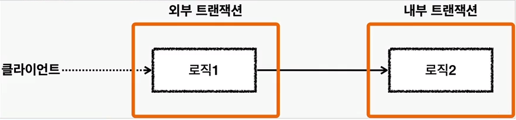

## 스프링 트랜잭션 전파 - 트랜잭션 한번 사용

### Commit 

```java
@Test
public void commit() {
    log.info("트랜잭션 시작");
    TransactionStatus status = platformTransactionManager.getTransaction(new DefaultTransactionAttribute());

    log.info("트랜잭션 커밋 시작");
    platformTransactionManager.commit(status);
    log.info("트랜잭션 커밋 완료");
}
```

```text
o.s.j.d.DataSourceTransactionManager     : Creating new transaction with name [null]: PROPAGATION_REQUIRED,ISOLATION_DEFAULT
o.s.j.d.DataSourceTransactionManager     : Acquired Connection [HikariProxyConnection@1203852392 wrapping conn0: url=jdbc:h2:mem:9532ff42-3551-4dfe-a4b7-50a15137f91e user=SA] for JDBC transaction
o.s.j.d.DataSourceTransactionManager     : Switching JDBC Connection [HikariProxyConnection@1203852392 wrapping conn0: url=jdbc:h2:mem:9532ff42-3551-4dfe-a4b7-50a15137f91e user=SA] to manual commit
c.e.s.propagation.BasicTxTest            : 트랜잭션 커밋 시작
o.s.j.d.DataSourceTransactionManager     : Initiating transaction commit
o.s.j.d.DataSourceTransactionManager     : Committing JDBC transaction on Connection [HikariProxyConnection@1203852392 wrapping conn0: url=jdbc:h2:mem:9532ff42-3551-4dfe-a4b7-50a15137f91e user=SA]
o.s.j.d.DataSourceTransactionManager     : Releasing JDBC Connection [HikariProxyConnection@1203852392 wrapping conn0: url=jdbc:h2:mem:9532ff42-3551-4dfe-a4b7-50a15137f91e user=SA] after transaction
c.e.s.propagation.BasicTxTest            : 트랜잭션 커밋 완료
```

### Rollback

```java
@Test
public void rollback() {
    log.info("트랜잭션 시작");
    TransactionStatus status = platformTransactionManager.getTransaction(new DefaultTransactionAttribute());

    log.info("트랜잭션 롤백 시작");
    platformTransactionManager.rollback(status);
    log.info("트랜잭션 롤백 완료");
}
```

```text
c.e.s.propagation.BasicTxTest            : 트랜잭션 시작
o.s.j.d.DataSourceTransactionManager     : Creating new transaction with name [null]: PROPAGATION_REQUIRED,ISOLATION_DEFAULT
o.s.j.d.DataSourceTransactionManager     : Acquired Connection [HikariProxyConnection@785140711 wrapping conn0: url=jdbc:h2:mem:0baf9460-f077-442e-af99-1afc8ab1f3eb user=SA] for JDBC transaction
o.s.j.d.DataSourceTransactionManager     : Switching JDBC Connection [HikariProxyConnection@785140711 wrapping conn0: url=jdbc:h2:mem:0baf9460-f077-442e-af99-1afc8ab1f3eb user=SA] to manual commit
c.e.s.propagation.BasicTxTest            : 트랜잭션 롤백 시작
o.s.j.d.DataSourceTransactionManager     : Initiating transaction rollback
o.s.j.d.DataSourceTransactionManager     : Rolling back JDBC transaction on Connection [HikariProxyConnection@785140711 wrapping conn0: url=jdbc:h2:mem:0baf9460-f077-442e-af99-1afc8ab1f3eb user=SA]
o.s.j.d.DataSourceTransactionManager     : Releasing JDBC Connection [HikariProxyConnection@785140711 wrapping conn0: url=jdbc:h2:mem:0baf9460-f077-442e-af99-1afc8ab1f3eb user=SA] after transaction
c.e.s.propagation.BasicTxTest            : 트랜잭션 롤백 완료
```

## 스프링 트랜잭션 전파 - 트랜잭션 두번 사용

### 트랜잭션이 각각 따로 사용되는 경우

커넥션은 재사용을 함. 트랜잭션이 끝나면 커넥션 풀에 커넥션을 반환하기 때문임.

하지만 이 둘은 완전히 다른 커넥션임. 커넥션풀에서 커넥션을 꺼낼때 내부적으로 히카리 프록시 커넥션이라는
객체를 생성해서 반환하기 떄문에, 이 주소가 다름 (히카리 프록시 커넥션 내부에는 실제 커넥션이 포함되어 있다.)

```java
@Test
public void double_commit() {
    log.info("트랜잭션1 시작");
    TransactionStatus status = platformTransactionManager.getTransaction(new DefaultTransactionAttribute());
    log.info("트랜잭션1 커밋");
    platformTransactionManager.commit(status);

    log.info("트랜잭션2 시작");
    TransactionStatus status2 = platformTransactionManager.getTransaction(new DefaultTransactionAttribute());
    log.info("트랜잭션2 커밋");
    platformTransactionManager.commit(status2);
}
```

```text
c.e.s.propagation.BasicTxTest            : 트랜잭션1 시작
o.s.j.d.DataSourceTransactionManager     : Creating new transaction with name [null]: PROPAGATION_REQUIRED,ISOLATION_DEFAULT
o.s.j.d.DataSourceTransactionManager     : Acquired Connection [HikariProxyConnection@237594516 wrapping conn0: url=jdbc:h2:mem:00b512b7-569c-4f38-8dcb-17d568b2d9c4 user=SA] for JDBC transaction
o.s.j.d.DataSourceTransactionManager     : Switching JDBC Connection [HikariProxyConnection@237594516 wrapping conn0: url=jdbc:h2:mem:00b512b7-569c-4f38-8dcb-17d568b2d9c4 user=SA] to manual commit
c.e.s.propagation.BasicTxTest            : 트랜잭션1 커밋
o.s.j.d.DataSourceTransactionManager     : Initiating transaction commit
o.s.j.d.DataSourceTransactionManager     : Committing JDBC transaction on Connection [HikariProxyConnection@237594516 wrapping conn0: url=jdbc:h2:mem:00b512b7-569c-4f38-8dcb-17d568b2d9c4 user=SA]
o.s.j.d.DataSourceTransactionManager     : Releasing JDBC Connection [HikariProxyConnection@237594516 wrapping conn0: url=jdbc:h2:mem:00b512b7-569c-4f38-8dcb-17d568b2d9c4 user=SA] after transaction
c.e.s.propagation.BasicTxTest            : 트랜잭션2 시작
o.s.j.d.DataSourceTransactionManager     : Creating new transaction with name [null]: PROPAGATION_REQUIRED,ISOLATION_DEFAULT
o.s.j.d.DataSourceTransactionManager     : Acquired Connection [HikariProxyConnection@210055609 wrapping conn0: url=jdbc:h2:mem:00b512b7-569c-4f38-8dcb-17d568b2d9c4 user=SA] for JDBC transaction
o.s.j.d.DataSourceTransactionManager     : Switching JDBC Connection [HikariProxyConnection@210055609 wrapping conn0: url=jdbc:h2:mem:00b512b7-569c-4f38-8dcb-17d568b2d9c4 user=SA] to manual commit
c.e.s.propagation.BasicTxTest            : 트랜잭션2 커밋
o.s.j.d.DataSourceTransactionManager     : Initiating transaction commit
o.s.j.d.DataSourceTransactionManager     : Committing JDBC transaction on Connection [HikariProxyConnection@210055609 wrapping conn0: url=jdbc:h2:mem:00b512b7-569c-4f38-8dcb-17d568b2d9c4 user=SA]
o.s.j.d.DataSourceTransactionManager     : Releasing JDBC Connection [HikariProxyConnection@210055609 wrapping conn0: url=jdbc:h2:mem:00b512b7-569c-4f38-8dcb-17d568b2d9c4 user=SA] after transaction
```

### 두개의 트랜잭션 - 커밋, 롤백

```java
@Test
public void double_commit_rollback() {
    log.info("트랜잭션1 시작");
    TransactionStatus status = platformTransactionManager.getTransaction(new DefaultTransactionAttribute());
    log.info("트랜잭션1 커밋");
    platformTransactionManager.commit(status);

    log.info("트랜잭션2 시작");
    TransactionStatus status2 = platformTransactionManager.getTransaction(new DefaultTransactionAttribute());
    log.info("트랜잭션2 롤백");
    platformTransactionManager.rollback(status2);
}
```

```text
c.e.s.propagation.BasicTxTest            : 트랜잭션1 시작
o.s.j.d.DataSourceTransactionManager     : Creating new transaction with name [null]: PROPAGATION_REQUIRED,ISOLATION_DEFAULT
o.s.j.d.DataSourceTransactionManager     : Acquired Connection [HikariProxyConnection@116806060 wrapping conn0: url=jdbc:h2:mem:68fe3ed2-48f1-4a44-989a-00c0ebdcb75d user=SA] for JDBC transaction
o.s.j.d.DataSourceTransactionManager     : Switching JDBC Connection [HikariProxyConnection@116806060 wrapping conn0: url=jdbc:h2:mem:68fe3ed2-48f1-4a44-989a-00c0ebdcb75d user=SA] to manual commit
c.e.s.propagation.BasicTxTest            : 트랜잭션1 커밋
o.s.j.d.DataSourceTransactionManager     : Initiating transaction commit
o.s.j.d.DataSourceTransactionManager     : Committing JDBC transaction on Connection [HikariProxyConnection@116806060 wrapping conn0: url=jdbc:h2:mem:68fe3ed2-48f1-4a44-989a-00c0ebdcb75d user=SA]
o.s.j.d.DataSourceTransactionManager     : Releasing JDBC Connection [HikariProxyConnection@116806060 wrapping conn0: url=jdbc:h2:mem:68fe3ed2-48f1-4a44-989a-00c0ebdcb75d user=SA] after transaction
c.e.s.propagation.BasicTxTest            : 트랜잭션2 시작
o.s.j.d.DataSourceTransactionManager     : Creating new transaction with name [null]: PROPAGATION_REQUIRED,ISOLATION_DEFAULT
o.s.j.d.DataSourceTransactionManager     : Acquired Connection [HikariProxyConnection@674349432 wrapping conn0: url=jdbc:h2:mem:68fe3ed2-48f1-4a44-989a-00c0ebdcb75d user=SA] for JDBC transaction
o.s.j.d.DataSourceTransactionManager     : Switching JDBC Connection [HikariProxyConnection@674349432 wrapping conn0: url=jdbc:h2:mem:68fe3ed2-48f1-4a44-989a-00c0ebdcb75d user=SA] to manual commit
c.e.s.propagation.BasicTxTest            : 트랜잭션2 롤백
o.s.j.d.DataSourceTransactionManager     : Initiating transaction rollback
o.s.j.d.DataSourceTransactionManager     : Rolling back JDBC transaction on Connection [HikariProxyConnection@674349432 wrapping conn0: url=jdbc:h2:mem:68fe3ed2-48f1-4a44-989a-00c0ebdcb75d user=SA]
o.s.j.d.DataSourceTransactionManager     : Releasing JDBC Connection [HikariProxyConnection@674349432 wrapping conn0: url=jdbc:h2:mem:68fe3ed2-48f1-4a44-989a-00c0ebdcb75d user=SA] after transaction
```

## 스프링 트랜잭션 전파 - 전파 기본

### 외부 트랜잭션이 수행중인데, 내부 트랜잭션이 추가로 수행되는 경우



스프링은 이 경우 외부 트랜잭션과 내부 트랜잭션을 묶어서 `하나의 트랜잭션을 만들어준다`.
내부 트랜잭션이 외부 트랜잭션에 참여하는 것이다. 이것이 기본동작이고, 옵션을 통해 다른 동작방식도 선택할 수 있다.


스프링은 이래를 돕기 위해 `논리 트랜잭션`과 `물리 트랜잭션`이라는 개념을 나눈다.
`논리 트랜잭션`들은 하나의 물리 트랜잭션으로 묶인다. `물리 트랜잭션` 은 우리가 이해하는 실제 DB 에 적용되는
트랜잭션을 뜻한다. 실제 Connection 을 통해서 트랜잭션을 시작(setAutoCommit(false)) 하고 실제 Connection 틍해 커밋, 롤백하는 단위이다.
또한, `논리 트랜잭션` 은 트랜잭션 매니저를 통해 트랜잭션을 사용하는 단위이다.
이러한 `논리 트랜잭션 개념은 트랜잭션이 진행되는 중에 추가로 트랜잭션을 사용하는 경우에 나타난다.`
**단순히 트랜잭션이 하나인 경우 둘을 구분하지는 않는다.** 더 정확히는
`REQUIRED` 전파 옵션을 사용하는 경우에 나타나고, 이 옵션은 뒤에서 설명한다.

#### 그렇다면 왜 트랜잭션을 논리, 물리로 나눴는가

트랜잭션이 사용중일때 또 다른 트랜잭션이 내부에 사용되면 여러가지 복잡한 상황이 발생한다. 이 때 논리 트랜잭션 개념을 도입하면
다음과 같은 단순한 원칙을 만들 수 있다.

1. 모든 논리 트랜잭션이 커밋되어야 물리 트랜잭션이 커밋된다.
2. 하나의 논리 트랜잭션이라도 롤백되면 물리트랜잭션은 롤백된다.

풀어서 설명하면 모든 트랜잭션 매니저를 커밋해야 물리 트랜잭션이 커밋된다. 하나의 트랜잭션 매니저라도 롤백하면
물리 트랜잭션은 롤백된다.


